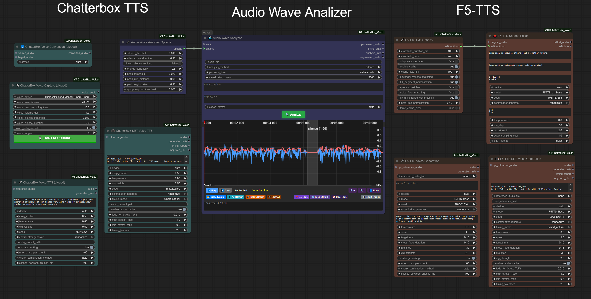
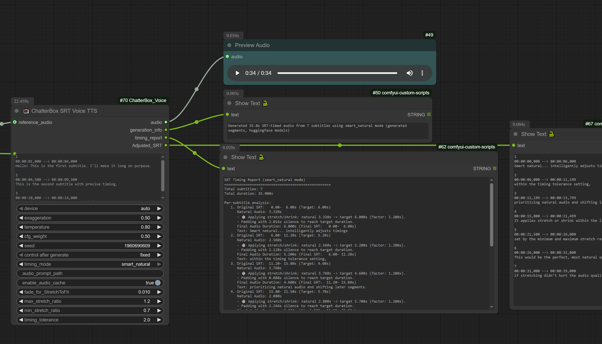

<a id="readme-top"></a>

[](https://discord.gg/EwKE8KBDqD)
[![Stargazers][stars-shield]][stars-url]
[![Issues][issues-shield]][issues-url]
[![Forks][forks-shield]][forks-url]
[![Dynamic TOML Badge][version-shield]][version-url]
[](https://ko-fi.com/diogogo)

# ComfyUI ChatterBox SRT Voice (diogod) v3.4.4

[](https://ko-fi.com/diogogo)

> **⚠️ PROJECT EVOLVED TO TTS AUDIO SUITE v4.0.0**
> 
> This project has evolved into [**TTS Audio Suite**](https://github.com/diodiogod/TTS-Audio-Suite), a universal multi-engine TTS platform supporting ChatterBox, F5-TTS, and future engines like RVC.
>
> **🔄 For New Users**: Use [TTS Audio Suite v4.0.0+](https://github.com/diodiogod/TTS-Audio-Suite) for the latest unified architecture  
> **🛠️ For Existing Users**: This v3.x branch remains for legacy workflow compatibility
>
> **⚠️ Breaking Changes**: v4.0.0 requires workflow migration due to architectural changes

*This is a refactored node, originally created by [ShmuelRonen](https://github.com/ShmuelRonen/ComfyUI_ChatterBox_Voice).*

<div align="center">
  
</div>

An unofficial ComfyUI custom node integration for High-quality Text-to-Speech and Voice Conversion nodes for ComfyUI using ResembleAI's ChatterboxTTS with unlimited text length and with a node specially made for dealing with SRT timings.

<details>
<summary><h2>📋 Table of Contents</h2></summary>

- [🆕 What's New in my Project?](#-whats-new-in-my-project)
  - [SRT Timing and TTS Node](#srt-timing-and-tts-node)
  - [🆕 F5-TTS Integration and 🆕 Audio Analyzer](#-f5-tts-integration-and--audio-analyzer)
  - [🎭 Character & Narrator Switching](#-character--narrator-switching)
  - [🌍 Language Switching with Bracket Syntax](#-language-switching-with-bracket-syntax)
  - [🔄 Iterative Voice Conversion](#-iterative-voice-conversion)
  - [⏸️ Pause Tags System](#️-pause-tags-system)
  - [🌍 Multi-language ChatterBox Support](#-multi-language-chatterbox-support)
- [🎥 Demo Videos](#-demo-videos)
- [Features](#features)
- [🚀 Quick Start](#-quick-start)
- [Installation](#installation)
  - [Prerequisites](#prerequisites)
  - [Installation Methods](#installation-methods)
  - [Troubleshooting Dependency Issues](#troubleshooting-dependency-issues)
  - [Updating the Node](#updating-the-node)
- [Enhanced Features](#enhanced-features)
- [Usage](#usage)
  - [Voice Recording](#voice-recording)
  - [Enhanced Text-to-Speech](#enhanced-text-to-speech)
  - [F5-TTS Voice Synthesis](#f5-tts-voice-synthesis)
  - [Voice Conversion with Iterative Refinement](#voice-conversion-with-iterative-refinement)
- [📁 Example Workflows](#-example-workflows)
- [Settings Guide](#settings-guide)
- [Text Processing Capabilities](#text-processing-capabilities)
- [License](#license)
- [Credits](#credits)
- [🔗 Links](#-links)

</details>

## 🆕 What's New in my Project?

<details>
<summary><h3>📺 SRT Timing and TTS Node</h3></summary>



The **"ChatterBox SRT Voice TTS"** node allows TTS generation by processing SRT content (SubRip Subtitle) files, ensuring precise timing and synchronization with your audio.

**Key SRT Features:**

* **SRT style Processing**: Uses SRT style to generate TTS, aligning audio with subtitle timings
* **`smart_natural` Timing Mode**: Intelligent shifting logic that prevents overlaps and ensures natural speech flow
* **`Adjusted_SRT` Output**: Provides actual timings for generated audio for accurate post-processing
* **Segment-Level Caching**: Only regenerates modified segments, significantly speeding up workflows

For comprehensive technical information, refer to the [SRT_IMPLEMENTATION.md](docs/Dev%20reports/SRT_IMPLEMENTATION.md) file.

</details>

<details>
<summary><h3>🆕 F5-TTS Integration and 🆕 Audio Analyzer</h3></summary>


* **F5-TTS Voice Synthesis**: High-quality voice cloning with reference audio + text
* **Audio Wave Analyzer**: Interactive waveform visualization for precise timing extraction
* **Multi-language Support**: English, German, Spanish, French, Japanese models
* **Speech Editing Workflows**: Advanced F5-TTS editing capabilities

</details>

<details>
<summary><h3>🎭 Character & Narrator Switching</h3></summary>

**NEW in v3.1.0**: Seamless character switching for both F5TTS and ChatterBox engines!

* **Multi-Character Support**: Use `[CharacterName]` tags to switch between different voices
* **Voice Folder Integration**: Organized character voice management system
* **🏷️ Character Aliases**: User-friendly alias system - use `[Alice]` instead of `[female_01]` with `#character_alias_map.txt`
* **Robust Fallback**: Graceful handling when characters not found (no errors!)
* **Universal Compatibility**: Works with both F5TTS and ChatterBox TTS engines
* **SRT Integration**: Character switching within subtitle timing
* **Backward Compatible**: Existing workflows work unchanged

**📖 [Complete Character Switching Guide](docs/CHARACTER_SWITCHING_GUIDE.md)**

Example usage:
```
Hello! This is the narrator speaking.
[Alice] Hi there! I'm Alice, nice to meet you.
[Bob] And I'm Bob! Great to meet you both.
Back to the narrator for the conclusion.
```

</details>

<details>
<summary><h3>🌍 Language Switching with Bracket Syntax</h3></summary>

**NEW in v3.4.0**: Seamless language switching using simple bracket notation!

* **Language Code Syntax**: Use `[language:character]` tags to switch languages and models automatically
* **Smart Model Loading**: Automatically loads correct language models (F5-DE, F5-FR, German, Norwegian, etc.)
* **Flexible Aliases** *(v3.4.3)*: Support for `[German:Alice]`, `[Brazil:Bob]`, `[USA:]`, `[Portugal:]` - no need to remember language codes!
* **Standard Format**: Also supports traditional `[fr:Alice]`, `[de:Bob]`, or `[es:]` (language only) patterns
* **Character Integration**: Combines perfectly with character switching and alias system
* **Performance Optimized**: Language groups processed efficiently to minimize model switching
* **Alias Support**: Language defaults work with character alias system

**Supported Languages:**
* **F5-TTS**: English (en), German (de), Spanish (es), French (fr), Italian (it), Japanese (jp), Thai (th), Portuguese (pt)
* **ChatterBox**: English (en), German (de), Norwegian (no/nb/nn)

Example usage:
```
Hello! This is English text with the default model.
[de:Alice] Hallo! Ich spreche Deutsch mit Alice's Stimme.
[fr:] Bonjour! Je parle français avec la voix du narrateur.
[es:Bob] ¡Hola! Soy Bob hablando en español.
Back to English with the original model.
```

**Advanced SRT Integration:**
```srt
1
00:00:01,000 --> 00:00:04,000
Hello! Welcome to our multilingual show.

2
00:00:04,500 --> 00:00:08,000
[de:female_01] Willkommen zu unserer mehrsprachigen Show!

3
00:00:08,500 --> 00:00:12,000
[fr:] Bienvenue à notre émission multilingue!
```

</details>

<details>
<summary><h3>🔄 Iterative Voice Conversion</h3></summary>

**NEW**: Progressive voice refinement with intelligent caching for instant experimentation!

* **Refinement Passes**: Multiple conversion iterations (1-30, recommended 1-5)
* **Smart Caching**: Results cached up to 5 iterations - change from 5→3→4 passes instantly
* **Progressive Quality**: Each pass refines output to sound more like target voice

</details>

<details>
<summary><h3>⏸️ Pause Tags System</h3></summary>

**NEW**: Intelligent pause insertion for natural speech timing control!

* **Smart Pause Syntax**: Use `[pause:duration]` tags anywhere in your text
* **Flexible Duration Formats**: 
  - Seconds: `[pause:1.5]` or `[pause:2s]`
  - Milliseconds: `[pause:500ms]` or `[pause:1200ms]`
  - Numbers only: `[pause:2]` (defaults to seconds)
* **Character Integration**: Pause tags work seamlessly with character switching
* **Intelligent Caching**: Changing pause durations won't regenerate unchanged text segments
* **Universal Support**: Works across all TTS nodes (ChatterBox, F5-TTS, SRT)
* **Automatic Processing**: No additional parameters needed - just add tags to your text

Example usage:
```
Welcome to our show! [pause:1s] Today we'll discuss exciting topics.
[Alice] I'm really excited! [pause:500ms] This will be great.
[pause:2] Let's get started with the main content.
```

</details>

<details>
<summary><h3>🌍 Multi-language ChatterBox Support</h3></summary>

**NEW in v3.3.0**: ChatterBox TTS and SRT nodes now support multiple languages with automatic model management!

**Supported Languages:**
- 🇺🇸 **English**: Original ResembleAI model (default)
- 🇩🇪 **German**: High-quality German ChatterBox model (stlohrey/chatterbox_de)
- 🇳🇴 **Norwegian**: Norwegian ChatterBox model (akhbar/chatterbox-tts-norwegian)

**Key Features:**
* **Language Dropdown**: Simple language selection in all ChatterBox nodes
* **Auto-Download**: Models download automatically on first use (~1GB per language)
* **Local Priority**: Prefers locally installed models over downloads for offline use
* **Safetensors Support**: Modern format support for newer language models
* **Seamless Integration**: Works with existing workflows - just select your language

**Usage**: Select language from dropdown → First generation downloads model → Subsequent generations use cached model

</details>

<div align="right"><a href="#-table-of-contents">Back to top</a></div>

## 🎥 Demo Videos

<div align="center">
  <a href="https://youtu.be/aHz1mQ2bvEY">
    
  </a>
  <br>
  <strong><a href="https://youtu.be/aHz1mQ2bvEY">▶️ v3.2 Features Overview (20min) - F5-TTS Integration, Speech Editor & More!</a></strong>
</div>

<br>

<div align="center">
  <a href="https://youtu.be/VyOawMrCB1g?si=7BubljRhsudGqG3s">
    
  </a>
  <br>
  <strong><a href="https://youtu.be/VyOawMrCB1g?si=7BubljRhsudGqG3s">▶️ Original Demo - SRT Timing & Basic Features</a></strong>
</div>

<details>
<summary><h3>📜 Original ShmuelRonen ChatterBox TTS Nodes</h3></summary>

<div align="center">
  
  
</div>

* **Voice Recording**: Smart silence detection for voice capture
* **Enhanced Chunking**: Intelligent text splitting with multiple combination methods
* **Unlimited Text Length**: No character limits with smart processing

**Original creator:** [ShmuelRonen](https://github.com/ShmuelRonen/ComfyUI_ChatterBox_Voice)

</details>

<div align="right"><a href="#-table-of-contents">Back to top</a></div>

## Features

- 🎤 **ChatterBox TTS** - Generate speech from text with optional voice cloning
- 🎙️ **F5-TTS** - High-quality voice synthesis with reference audio + text cloning
- 🔄 **ChatterBox VC** - Convert voice from one speaker to another with iterative refinement
- 🎙️ **ChatterBox Voice Capture** - Record voice input with smart silence detection
- ⚡ **Fast & Quality** - Production-grade TTS that outperforms ElevenLabs
- 🎭 **Character Switching** - Multi-character TTS with `[CharacterName]` tags and alias system
- 🌍 **Language Switching** - Use `[language:character]` syntax for seamless model switching (`[de:Alice]`, `[fr:]`, etc.)
- 😤 **Emotion Control** - Unique exaggeration parameter for expressive speech
- 🌍 **Multi-language ChatterBox** - Support for English, German, Norwegian models with automatic download and local model prioritization
- 🌍 **Multi-language F5-TTS** - Support for English, German, Spanish, French, Japanese and more
- 📝 **Enhanced Chunking** - Intelligent text splitting for long content with multiple combination methods
- 🎵 **Advanced Audio Processing** - Optional FFmpeg support for premium audio quality with graceful fallback
- 🌊 **Audio Wave Analyzer** - Interactive waveform visualization and precise timing extraction for F5-TTS workflows → **[📖 Complete Guide](docs/🌊_Audio_Wave_Analyzer-Complete_User_Guide.md)**

<div align="right"><a href="#-table-of-contents">Back to top</a></div>

## 🚀 Quick Start

### Option 1: ComfyUI Manager (Recommended)
Use ComfyUI Manager to install "ComfyUI ChatterBox SRT Voice" - it handles dependencies automatically.

### Option 2: Manual Installation

**Get running in 5 minutes:**

1. **Clone the repository**

   ```bash
   cd ComfyUI/custom_nodes
   git clone https://github.com/diodiogod/ComfyUI_ChatterBox_SRT_Voice.git
   cd ComfyUI_ChatterBox_SRT_Voice
   ```

2. **Install Dependencies** (⚠️ **Critical for Manual Install**):
   
   **ComfyUI Portable:**
   ```bash
   # Windows:
   ..\..\..\python_embeded\python.exe -m pip install -r requirements.txt --no-user
   
   # Linux/Mac:
   ../../../python_embeded/python.exe -m pip install -r requirements.txt --no-user
   ```
   
   **ComfyUI with venv/conda:**
   ```bash
   # First activate your ComfyUI environment, then:
   pip install -r ComfyUI_ChatterBox_SRT_Voice/requirements.txt
   ```

> ⚠️ **Important**: Manual installs require installing dependencies in your ComfyUI's Python environment. If you get missing dependency errors, see the [detailed installation guide](#installation) below.

3. **Download Models** (Required)

   - Download from [HuggingFace ChatterBox](https://huggingface.co/ResembleAI/chatterbox/tree/main)
   - Place in `ComfyUI/models/chatterbox/`

3. **Try a Workflow**

   - Download: [ChatterBox Integration Workflow](example_workflows/Chatterbox%20integration.json)
   - Drag into ComfyUI and start generating!

4. **Restart ComfyUI** and look for 🎤 ChatterBox nodes

> **Need F5-TTS?** Also download F5-TTS models to `ComfyUI/models/F5-TTS/` from the links in the detailed installation below.

<div align="right"><a href="#-table-of-contents">Back to top</a></div>

## Installation

<details>
<summary>📋 Detailed Installation Guide (Click to expand if you're having dependency issues)</summary>

This section provides a detailed guide for installing ComfyUI ChatterBox SRT Voice, covering different ComfyUI installation methods.

### Prerequisites

*   ComfyUI installation (Portable, Direct with venv, or through Manager)
*   Python 3.12 or higher
*   **PortAudio library** (required for voice recording features):
    *   Linux: `sudo apt-get install portaudio19-dev`
    *   macOS: `brew install portaudio`
    *   Windows: Usually bundled with pip packages (no action needed)

### Installation Methods

#### 1. Portable Installation

For portable installations, follow these steps:

1.  Clone the repository into the `ComfyUI/custom_nodes` folder:

    ```bash
    cd ComfyUI/custom_nodes
    git clone https://github.com/diodiogod/ComfyUI_ChatterBox_SRT_Voice.git
    ```
2.  Navigate to the cloned directory:

    ```bash
    cd ComfyUI_ChatterBox_SRT_Voice
    ```
3.  Install the required dependencies.  **Important:** Use the `python.exe` executable located in your ComfyUI portable installation with environment isolation flags.

    ```bash
    ../../../python_embeded/python.exe -m pip install -r requirements.txt --no-user
    ```
    
    **Why the `--no-user` flag?**
    - Prevents installing to your system Python's user directory, which can cause import conflicts
    - Ensures packages install only to the portable environment for proper isolation

#### 2. Direct Installation with venv

If you have a direct installation with a virtual environment (venv), follow these steps:

1.  Clone the repository into the `ComfyUI/custom_nodes` folder:

    ```bash
    cd ComfyUI/custom_nodes
    git clone https://github.com/diodiogod/ComfyUI_ChatterBox_SRT_Voice.git
    ```
2.  Activate your ComfyUI virtual environment.  This is crucial to ensure dependencies are installed in the correct environment. The method to activate the venv may vary depending on your setup.  Here's a common example:

    ```bash
    cd ComfyUI
    . ./venv/bin/activate
    ```

    or on Windows:

    ```bash
    ComfyUI\venv\Scripts\activate
    ```
3.  Navigate to the cloned directory:

    ```bash
    cd custom_nodes/ComfyUI_ChatterBox_SRT_Voice
    ```
4.  Install the required dependencies using `pip`:

    ```bash
    pip install -r requirements.txt
    ```

#### 3. Installation through the ComfyUI Manager

1.  Install the ComfyUI Manager if you haven't already.
2.  Use the Manager to install the "ComfyUI ChatterBox SRT Voice" node.
3.  The manager might handle dependencies automatically, but it's still recommended to verify the installation.  Navigate to the node's directory:

    ```bash
    cd ComfyUI/custom_nodes/ComfyUI_ChatterBox_SRT_Voice
    ```
4.  Activate your ComfyUI virtual environment (see instructions in "Direct Installation with venv").
5.  If you encounter issues, manually install the dependencies:

    ```bash
    pip install -r requirements.txt
    ```

### Troubleshooting Dependency Issues

A common problem is installing dependencies in the wrong Python environment. Always ensure you are installing dependencies within your ComfyUI's Python environment.

*   **Verify your Python environment:** After activating your venv or navigating to your portable ComfyUI installation, check the Python executable being used:

    ```bash
    which python
    ```

    This should point to the Python executable within your ComfyUI installation (e.g., `ComfyUI/python_embeded/python.exe` or `ComfyUI/venv/bin/python`).
*   **If `s3tokenizer` fails to install:** This dependency can be problematic. Try upgrading your pip and setuptools:

    ```bash
    python -m pip install --upgrade pip setuptools wheel
    ```

    Then, try installing the requirements again.
*   **If you cloned the node manually (without the Manager):** Make sure you install the requirements.txt file.

### Updating the Node

To update the node to the latest version:

1.  Navigate to the node's directory:

    ```bash
    cd ComfyUI/custom_nodes/ComfyUI_ChatterBox_SRT_Voice
    ```
2.  Pull the latest changes from the repository:

    ```bash
    git pull
    ```
3.  Reinstall the dependencies (in case they have been updated):

    ```bash
    pip install -r requirements.txt
    ```

</details>

### 1. Clone Repository

```bash
cd ComfyUI/custom_nodes
git clone https://github.com/diodiogod/ComfyUI_ChatterBox_SRT_Voice.git
```

### 2. Install Dependencies

Some dependencies, particularly `s3tokenizer`, can occasionally cause installation issues on certain Python setups (e.g., Python 3.10, sometimes used by tools like Stability Matrix).

To minimize potential problems, it's highly recommended to first ensure your core packaging tools are up-to-date in your ComfyUI's virtual environment:

```bash
python -m pip install --upgrade pip setuptools wheel
```

After running the command above, install the node's specific requirements:

```bash
pip install -r requirements.txt
```

### 3. Optional: Install FFmpeg for Enhanced Audio Processing

ChatterBox Voice now supports FFmpeg for high-quality audio stretching. While not required, it's recommended for the best audio quality:

**Windows:**

```bash
winget install FFmpeg
# or with Chocolatey
choco install ffmpeg
```

**macOS:**

```bash
brew install ffmpeg
```

**Linux:**

```bash
# Ubuntu/Debian
sudo apt-get install ffmpeg

# Fedora
sudo dnf install ffmpeg
```

If FFmpeg is not available, ChatterBox will automatically fall back to using the built-in phase vocoder method for audio stretching - your workflows will continue to work without interruption.

### 4. Download Models

**Download the ChatterboxTTS models** and place them in:

```
ComfyUI/models/chatterbox/
```

**Required files:**

- `conds.pt` (105 KB)
- `s3gen.pt` (~1 GB)
- `t3_cfg.pt` (~1 GB)
- `tokenizer.json` (25 KB)
- `ve.pt` (5.5 MB)

**Download from:** https://huggingface.co/ResembleAI/chatterbox/tree/main

#### 4.1. Multilanguage ChatterBox Models (Optional)

**NEW in v3.3.0**: ChatterBox now supports multiple languages! Models will auto-download on first use, or you can manually install them for offline use.

**For manual installation**, create language-specific folders and download models:

```
ComfyUI/models/chatterbox/
├── English/          # Optional - for explicit English organization
│   ├── conds.pt
│   ├── s3gen.pt
│   ├── t3_cfg.pt
│   ├── tokenizer.json
│   └── ve.pt
├── German/           # German language models
│   ├── conds.safetensors
│   ├── s3gen.safetensors
│   ├── t3_cfg.safetensors
│   ├── tokenizer.json
│   └── ve.safetensors
└── Norwegian/        # Norwegian language models
    ├── conds.safetensors
    ├── s3gen.safetensors
    ├── t3_cfg.safetensors
    ├── tokenizer.json
    └── ve.safetensors
```

**Available ChatterBox Language Models:**

| Language   | HuggingFace Repository                                              | Format       | Auto-Download |
| ---------- | ------------------------------------------------------------------- | ------------ | ------------- |
| English    | [ResembleAI/chatterbox](https://huggingface.co/ResembleAI/chatterbox) | .pt          | ✅             |
| German     | [stlohrey/chatterbox_de](https://huggingface.co/stlohrey/chatterbox_de) | .safetensors | ✅             |
| Norwegian  | [akhbar/chatterbox-tts-norwegian](https://huggingface.co/akhbar/chatterbox-tts-norwegian) | .safetensors | ✅             |

**Usage:** Simply select your desired language from the dropdown in ChatterBox TTS or SRT nodes. First generation will auto-download the model (~1GB per language).

### 5. F5-TTS Models (Optional)

**For F5-TTS voice synthesis capabilities**, download F5-TTS models and place them in:

```
ComfyUI/models/F5-TTS/
```

**Available F5-TTS Models:**

| Model             | Language         | Download                                                                         | Size   |
| ----------------- | ---------------- | -------------------------------------------------------------------------------- | ------ |
| **F5TTS_Base**    | English          | [HuggingFace](https://huggingface.co/SWivid/F5-TTS/tree/main/F5TTS_Base)         | ~1.2GB |
| **F5TTS_v1_Base** | English (v1)     | [HuggingFace](https://huggingface.co/SWivid/F5-TTS/tree/main/F5TTS_v1_Base)      | ~1.2GB |
| **E2TTS_Base**    | English (E2-TTS) | [HuggingFace](https://huggingface.co/SWivid/E2-TTS/tree/main/E2TTS_Base)         | ~1.2GB |
| **F5-DE**         | German           | [HuggingFace](https://huggingface.co/aihpi/F5-TTS-German)                        | ~1.2GB |
| **F5-ES**         | Spanish          | [HuggingFace](https://huggingface.co/jpgallegoar/F5-Spanish)                     | ~1.2GB |
| **F5-FR**         | French           | [HuggingFace](https://huggingface.co/RASPIAUDIO/F5-French-MixedSpeakers-reduced) | ~1.2GB |
| **F5-JP**         | Japanese         | [HuggingFace](https://huggingface.co/Jmica/F5TTS)                                | ~1.2GB |

**Vocoder (Optional but Recommended):**

```
ComfyUI/models/F5-TTS/vocos/
├── config.yaml
├── pytorch_model.bin
└── vocab.txt
```

Download from: [Vocos Mel-24kHz](https://huggingface.co/charactr/vocos-mel-24khz)

**Complete Folder Structure:**

```
ComfyUI/models/F5-TTS/
├── F5TTS_Base/
│   ├── model_1200000.safetensors    ← Main model file
│   └── vocab.txt                    ← Vocabulary file
├── vocos/                           ← For offline vocoder
│   ├── config.yaml
│   └── pytorch_model.bin
└── F5TTS_v1_Base/
    ├── model_1250000.safetensors
    └── vocab.txt
```

**Required Files for Each Model:**

- `model_XXXXXX.safetensors` - The main model weights
- `vocab.txt` - Vocabulary/tokenizer file (download from same HuggingFace repo)

**Note:** F5-TTS uses internal config files, no config.yaml needed. Vocos vocoder doesn't need vocab.txt.

**Note:** F5-TTS models and vocoder will auto-download from HuggingFace if not found locally. The first generation may take longer while downloading (~1.2GB per model).

### 6. F5-TTS Voice References Setup

**For easy voice reference management**, create a dedicated voices folder:

```
ComfyUI/models/voices/
├── character1.wav
├── character1.reference.txt ← Contains: "Hello, I am character one speaking clearly."
├── character1.txt          ← Contains: "BBC Radio sample, licensed under CC3..."
├── narrator.wav
├── narrator.txt            ← Contains: "This is the narrator voice for storytelling."
├── my_voice.wav
└── my_voice.txt            ← Contains: "This is my personal voice sample."
```

**Voice Reference Requirements:**

- **Audio files**: WAV format, 5-30 seconds, clean speech, 24kHz recommended
- **Text files**: Exact transcription of what's spoken in the audio file
- **Naming**: `filename.wav` + `filename.reference.txt` (preferred) or `filename.txt` (fallback)
- **Character Names**: Character name = audio filename (without extension). Subfolders supported for organization.

**⚠️ F5-TTS Best Practices**: [Follow these guidelines to avoid inference failures](#f5-tts-inference-guidelines)

<details>
<summary><strong>📋 F5-TTS Inference Guidelines</strong></summary>

To avoid possible inference failures, make sure you follow these F5-TTS optimization guidelines:

1. **Reference Audio Duration**: Use reference audio <12s and leave proper silence space (e.g. 1s) at the end. Otherwise there is a risk of truncating in the middle of word, leading to suboptimal generation.

2. **Letter Case Handling**: Uppercased letters (best with form like K.F.C.) will be uttered letter by letter, and lowercased letters used for common words.

3. **Pause Control**: Add some spaces (blank: " ") or punctuations (e.g. "," ".") to explicitly introduce some pauses.

4. **Punctuation Spacing**: If English punctuation marks the end of a sentence, make sure there is a space " " after it. Otherwise not regarded as sentence chunk.

5. **Number Processing**: Preprocess numbers to Chinese letters if you want to have them read in Chinese, otherwise they will be read in English.

These guidelines help ensure optimal F5-TTS generation quality and prevent common audio artifacts.

</details>

### 7. Restart ComfyUI

<div align="right"><a href="#-table-of-contents">Back to top</a></div>

## 💖 Support This Project

If ChatterBox SRT Voice has been helpful for your projects, consider supporting its development:

[](https://ko-fi.com/diogogo)

Your support helps maintain and improve this project for the entire community!

> **Note**: This legacy project has evolved into [TTS Audio Suite](https://github.com/diodiogod/TTS-Audio-Suite). Consider supporting the new unified platform for continued development.

<div align="right"><a href="#-table-of-contents">Back to top</a></div>

## Enhanced Features

### 📝 Intelligent Text Chunking (NEW!)

**Long text support with smart processing:**

- **Character-based limits** (100-1000 chars per chunk)
- **Sentence boundary preservation** - won't cut mid-sentence
- **Multiple combination methods**:
  - `auto` - Smart selection based on text length
  - `concatenate` - Simple joining
  - `silence_padding` - Add configurable silence between chunks
  - `crossfade` - Smooth audio blending
- **Comma-based splitting** for very long sentences
- **Backward compatible** - works with existing workflows

**Chunking Controls (all optional):**

- `enable_chunking` - Enable/disable smart chunking (default: True)
- `max_chars_per_chunk` - Chunk size limit (default: 400)
- `chunk_combination_method` - How to join audio (default: auto)
- `silence_between_chunks_ms` - Silence duration (default: 100ms)

**Auto-selection logic:**

- **Text > 1000 chars** → silence_padding (natural pauses)
- **Text > 500 chars** → crossfade (smooth blending)
- **Text < 500 chars** → concatenate (simple joining)

### 📦 Smart Model Loading

**Priority-based model detection:**

1. **Bundled models** in node folder (self-contained)
2. **ComfyUI models** in standard location
3. **HuggingFace download** with authentication

**Console output shows source:**

```
📦 Using BUNDLED ChatterBox (self-contained)
📦 Loading from bundled models: ./models/chatterbox
✅ ChatterboxTTS model loaded from bundled!
```

<div align="right"><a href="#-table-of-contents">Back to top</a></div>

## Usage

### Voice Recording

1. Add **"🎤 ChatterBox Voice Capture"** node
2. Select your microphone from the dropdown
3. Adjust recording settings:
   - **Silence Threshold**: How quiet to consider "silence" (0.001-0.1)
   - **Silence Duration**: How long to wait before stopping (0.5-5.0 seconds)
   - **Sample Rate**: Audio quality (8000-96000 Hz, default 44100)
4. Change the **Trigger** value to start a new recording
5. Connect output to TTS (for voice cloning) or VC nodes

### Enhanced Text-to-Speech

1. Add **"🎤 ChatterBox Voice TTS"** node
2. Enter your text (any length - automatic chunking)
3. Optionally connect reference audio for voice cloning
4. Adjust TTS settings:
   - **Exaggeration**: Emotion intensity (0.25-2.0)
   - **Temperature**: Randomness (0.05-5.0)
   - **CFG Weight**: Guidance strength (0.0-1.0)

### F5-TTS Voice Synthesis

1. Add **"🎤 F5-TTS Voice Generation"** node
2. Enter your target text (any length - automatic chunking)
3. **Required**: Connect reference audio for voice cloning
4. **Required**: Enter reference text that matches the reference audio exactly

<details>
<summary>📖 Voice Reference Setup Options</summary>

**Two ways to provide voice references:**

1. **Easy Method**: Select voice from `reference_audio_file` dropdown → text auto-detected from companion `.txt` file
2. **Manual Method**: Set `reference_audio_file` to "none" → connect `opt_reference_audio` + `opt_reference_text` inputs

</details>

5. Select F5-TTS model:
   - **F5TTS_Base**: English base model (recommended)
   - **F5TTS_v1_Base**: English v1 model
   - **E2TTS_Base**: E2-TTS model
   - **F5-DE**: German model
   - **F5-ES**: Spanish model
   - **F5-FR**: French model
   - **F5-JP**: Japanese model
6. Adjust F5-TTS settings:
   - **Temperature**: Voice variation (0.1-2.0, default: 0.8)
   - **Speed**: Speech speed (0.5-2.0, default: 1.0)
   - **CFG Strength**: Guidance strength (0.0-10.0, default: 2.0)
   - **NFE Step**: Quality vs speed (1-100, default: 32)

### Voice Conversion with Iterative Refinement

1. Add **"🔄 ChatterBox Voice Conversion"** node
2. Connect source audio (voice to convert)
3. Connect target audio (voice style to copy)
4. Configure refinement settings:
   - **Refinement Passes**: Number of conversion iterations (1-30, recommended 1-5)
   - Each pass refines the output to sound more like the target
   - **Smart Caching**: Results cached up to 5 iterations for instant experimentation

**🧠 Intelligent Caching Examples:**
- Run **3 passes** → caches iterations 1, 2, 3
- Change to **5 passes** → resumes from cached 3, runs 4, 5  
- Change to **2 passes** → returns cached iteration 2 instantly
- Change to **4 passes** → resumes from cached 3, runs 4

**💡 Pro Tip**: Start with 1 pass, then experiment with 2-5 passes to find the sweet spot for your audio. Each iteration can improves voice similarity!

<div align="right"><a href="#-table-of-contents">Back to top</a></div>

## 📁 Example Workflows

**Ready-to-use ComfyUI workflows** - Download and drag into ComfyUI:

### Chatterbox Workflows

| Workflow                   | Description                                 | Files                                                      |
| -------------------------- | ------------------------------------------- | ---------------------------------------------------------- |
| **ChatterBox SRT**         | SRT subtitle timing and TTS generation      | [📁 JSON](example_workflows/📺%20Chatterbox%20SRT.json)    |
| **ChatterBox Integration** | General ChatterBox TTS and Voice Conversion | [📁 JSON](example_workflows/Chatterbox%20integration.json) |

### F5-TTS Workflows

| Workflow                                 | Description                                             | Files                                                                                |
| ---------------------------------------- | ------------------------------------------------------- | ------------------------------------------------------------------------------------ |
| **Audio Wave Analyzer + F5 Speech Edit** | Interactive waveform analysis for F5-TTS speech editing | [📁 JSON](example_workflows/👄%20F5-TTS%20Speech%20Editor%20Workflow.json)           |
| **F5-TTS SRT and Normal Generation**     | F5-TTS integration with SRT subtitle processing         | [📁 JSON](example_workflows/🎤%20📺%20F5-TTS%20SRT%20and%20Normal%20Generation.json) |

> **Note:** To use workflows, download the `.json` files and drag them directly into your ComfyUI interface. The workflows will automatically load with the proper node connections.

<div align="right"><a href="#-table-of-contents">Back to top</a></div>

## Settings Guide

### Enhanced Chunking Settings

**For Long Articles/Books:**

- `max_chars_per_chunk=600`, `combination_method=silence_padding`, `silence_between_chunks_ms=200`

**For Natural Speech:**

- `max_chars_per_chunk=400`, `combination_method=auto` (default - works well)

**For Fast Processing:**

- `max_chars_per_chunk=800`, `combination_method=concatenate`

**For Smooth Audio:**

- `max_chars_per_chunk=300`, `combination_method=crossfade`

### Voice Recording Settings

**General Recording:**

- `silence_threshold=0.01`, `silence_duration=2.0` (default settings)

**Noisy Environment:**

- Higher `silence_threshold` (~0.05) to ignore background noise
- Longer `silence_duration` (~3.0) to avoid cutting off speech

**Quiet Environment:**

- Lower `silence_threshold` (~0.005) for sensitive detection
- Shorter `silence_duration` (~1.0) for quick stopping

### TTS Settings

**General Use:**

- `exaggeration=0.5`, `cfg_weight=0.5` (default settings work well)

**Expressive Speech:**

- Lower `cfg_weight` (~0.3) + higher `exaggeration` (~0.7)
- Higher exaggeration speeds up speech; lower CFG slows it down

<div align="right"><a href="#-table-of-contents">Back to top</a></div>

## Text Processing Capabilities

### 📚 No Hard Text Limits!

Unlike many TTS systems:

- **OpenAI TTS**: 4096 character limit
- **ElevenLabs**: 2500 character limit
- **ChatterBox**: No documented limits + intelligent chunking

### 🧠 Smart Text Splitting

**Sentence Boundary Detection:**

- Splits on `.!?` with proper spacing
- Preserves sentence integrity
- Handles abbreviations and edge cases

**Long Sentence Handling:**

- Splits on commas when sentences are too long
- Maintains natural speech patterns
- Falls back to character limits only when necessary

<div align="right"><a href="#-table-of-contents">Back to top</a></div>

## License

MIT License - Same as ChatterboxTTS

<div align="right"><a href="#-table-of-contents">Back to top</a></div>

## Credits

- **ResembleAI** for ChatterboxTTS
- **ComfyUI** team for the amazing framework
- **sounddevice** library for audio recording functionality
- **[ShmuelRonen](https://github.com/ShmuelRonen/ComfyUI_ChatterBox_Voice)** for the Original ChatteBox Voice TTS node
- **[Diogod](https://github.com/diodiogod/ComfyUI_ChatterBox_SRT_Voice)** for the SRT Timing and TTS Node implementation

<div align="right"><a href="#-table-of-contents">Back to top</a></div>

## 🔗 Links

- [Resemble AI ChatterBox](https://github.com/resemble-ai/chatterbox)
- [Model Downloads (Hugging Face)](https://huggingface.co/ResembleAI/chatterbox/tree/main) ⬅️ **Download models here**
- [ChatterBox Demo](https://resemble-ai.github.io/chatterbox_demopage/)
- [ComfyUI](https://github.com/comfyanonymous/ComfyUI)
- [Resemble AI Official Site](https://www.resemble.ai/chatterbox/)

---

**Note**: The original ChatterBox model includes Resemble AI's Perth watermarking system for responsible AI usage. This ComfyUI integration includes the Perth dependency but has watermarking disabled by default to ensure maximum compatibility. Users can re-enable watermarking by modifying the code if needed, while maintaining the full quality and capabilities of the underlying TTS model.

<!-- MARKDOWN LINKS & IMAGES -->

<!-- https://www.markdownguide.org/basic-syntax/#reference-style-links -->

[contributors-shield]: https://img.shields.io/github/contributors/diodiogod/ComfyUI_ChatterBox_SRT_Voice.svg?style=for-the-badge
[contributors-url]: https://github.com/diodiogod/ComfyUI_ChatterBox_SRT_Voice/graphs/contributors
[forks-shield]: https://img.shields.io/github/forks/diodiogod/ComfyUI_ChatterBox_SRT_Voice.svg?style=for-the-badge
[forks-url]: https://github.com/diodiogod/ComfyUI_ChatterBox_SRT_Voice/network/members
[stars-shield]: https://img.shields.io/github/stars/diodiogod/ComfyUI_ChatterBox_SRT_Voice.svg?style=for-the-badge
[stars-url]: https://github.com/diodiogod/ComfyUI_ChatterBox_SRT_Voice/stargazers
[issues-shield]: https://img.shields.io/github/issues/diodiogod/ComfyUI_ChatterBox_SRT_Voice.svg?style=for-the-badge
[issues-url]: https://github.com/diodiogod/ComfyUI_ChatterBox_SRT_Voice/issues
[license-shield]: https://img.shields.io/github/license/diodiogod/ComfyUI_ChatterBox_SRT_Voice.svg?style=for-the-badge
[license-url]: https://github.com/diodiogod/ComfyUI_ChatterBox_SRT_Voice/blob/master/LICENSE.txt

[version-shield]: https://img.shields.io/badge/dynamic/toml?url=https%3A%2F%2Fraw.githubusercontent.com%2Fdiodiogod%2FComfyUI_ChatterBox_SRT_Voice%2Fmain%2Fpyproject.toml&query=%24.project.version&label=Version&color=red&style=for-the-badge
[version-url]: pyproject.toml
